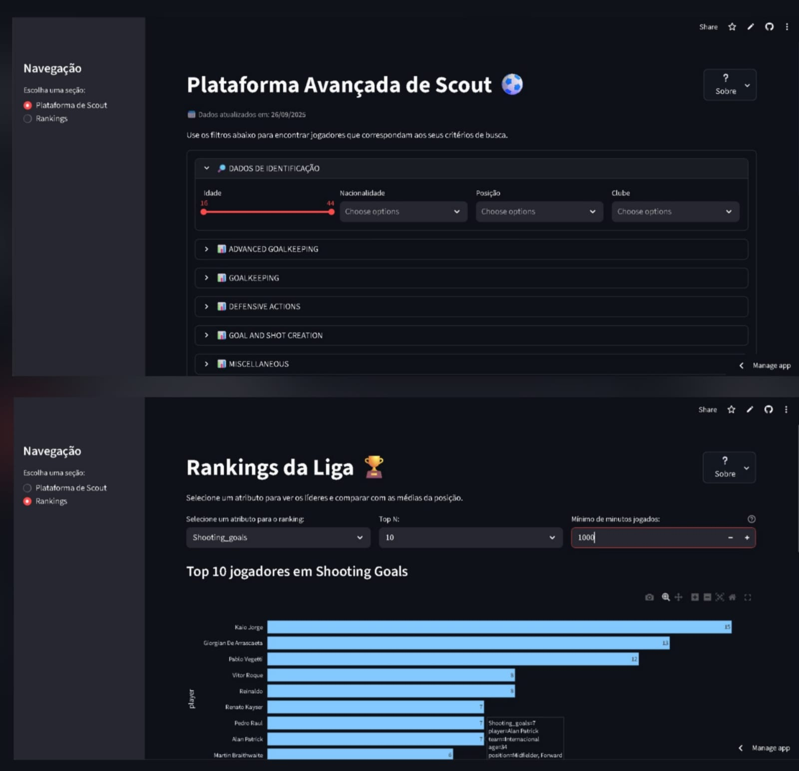

# ⚽ Plataforma de Scout de Futebol (Football Scout Platform)



## 🚀 Sobre o Projeto

Esta aplicação é uma ferramenta interativa de **Scout e Análise de Desempenho** para jogadores de futebol, desenvolvida em Python. Utilizando dados estatísticos detalhados coletados do portal [FBref](https://fbref.com/) através de Web Scraping, a plataforma permite que analistas, agentes e entusiastas do esporte identifiquem talentos e analisem jogadores de forma profunda e visual.

O projeto foi dividido em duas seções principais:
1.  **Plataforma de Scout:** Uma ferramenta de busca detalhada para encontrar jogadores que correspondam a critérios específicos, com mais de 200 filtros estatísticos.
2.  **Rankings:** Um dashboard interativo para visualizar os líderes da liga em atributos específicos, com métricas de contexto por posição.

## ✨ Funcionalidades Principais

- **Busca Detalhada:** Filtros dinâmicos para dados demográficos (idade, posição, nacionalidade) e um vasto conjunto de estatísticas de jogo.
- **Visualização de Rankings:** Gráficos interativos para classificar os melhores jogadores em qualquer atributo selecionado (Top 5, 10, 15, etc.).
- **Contexto Estatístico:** Métricas de referência (média, máximo, mínimo) por posição (defensores, meio-campistas, atacantes) para cada atributo, oferecendo um benchmark para análise.
- **Ficha Completa do Jogador:** Resultados de busca apresentados em "cards", onde cada jogador pode ser expandido para uma análise detalhada de seus atributos.
- **Paginação e Exportação:** Navegação otimizada para grandes volumes de resultados e opção de download dos dados filtrados em formato `.csv`.

## 🛠️ Tecnologias Utilizadas

- **Coleta de Dados (Web Scraping):**
  - Python | Scrapy | Playwright
- **Análise e Processamento de Dados:**
  - Python | Pandas
- **Dashboard Interativo e Visualização:**
  - Python | Streamlit | Plotly

## ⚙️ Como Executar o Projeto Localmente

Siga os passos abaixo para rodar a aplicação em sua máquina.

1.  **Clone o repositório:**
    ```bash
    git clone [https://github.com/seu-usuario/nome-do-repositorio.git](https://github.com/seu-usuario/nome-do-repositorio.git)
    cd nome-do-repositorio
    ```
2.  **Crie e ative um ambiente virtual:**
    ```bash
    python -m venv .venv
    # No Windows:
    .venv\Scripts\activate
    # No macOS/Linux:
    source .venv/bin/activate
    ```
3.  **Instale as dependências:**
    ```bash
    pip install -r requirements.txt
    ```
4.  **Execute a aplicação Streamlit:**
    ```bash
    streamlit run app.py
    ```

## 👏 Agradecimentos

- Dados fornecidos por [FBref](https://fbref.com/), via [Sports Reference](https://www.sports-reference.com/).
